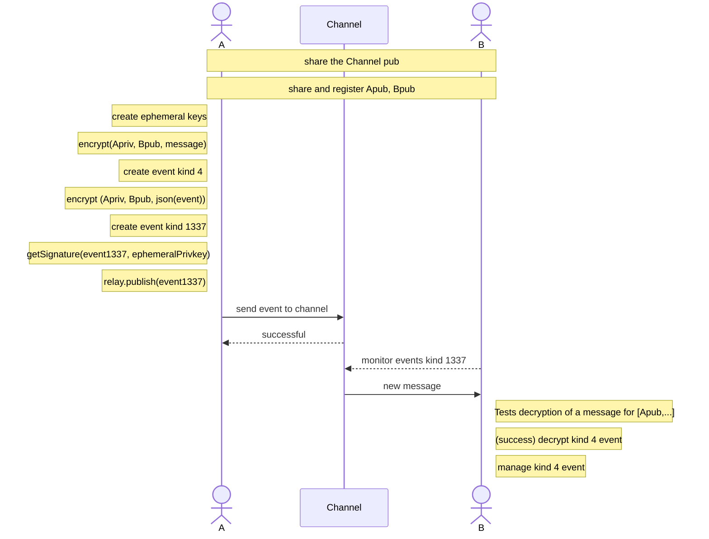

# Nostr-Stealth (proof-of-concept)

## Introduction

Nostr-Stealth is a cutting-edge encryption method built on top of the Nostr protocol, specifically designed to ensure sender and receiver metadata full anonymity. Leveraging the concept of channels (or mixers), Nostr-Stealth ensures that individual messages between users cannot be distinguished or differentiated, thus enhancing user privacy.

## Features

1. **Metadata Encryption:** Sender and receiver metadata is securely encrypted to ensure complete anonymity.
2. **Channel Mixer:** The destination for each message is always the channel. By design, this ensures the real receiver remains undiscoverable.
3. **Ephemeral Keys:** Every message sent uses ephemeral keys, ensuring that tracking a message back to its sender becomes an impossible task.

## Prerequisites

- Node.js v18
- Npm (comes with Node.js)

## Installation

1. Clone the repository:
   ```bash
   git clone https://github.com/[Your-Repo-Name]/Nostr-Stealth.git
   ```

2. Navigate to the project directory:
   ```bash
   cd nostr-stealth
   ```

3. Install dependencies:
   ```bash
   yarn install
   ```

## Usage
1. **Preparation**:
   - Copy `env-sample` to `.env`
   - Add private and public keys for the sender, receiver and channel in `hex` format.
     - The channel privkey is optional for this example
   - Add a relay address

2. **Set Up Channel**:
   - The channel is a valid public key. Create a pair of valid keys and update .env (CHANPRIV is optional, because it can't decrypt messages)

3. **Sending Messages**:
   - $ node publish.js "your-message"
   - Write your message and hit send. Your metadata will be encrypted and mixed with others in the channel.

4. **Receiving Messages**:
   - node receive.js
   - The last message for you within the channel will be displayed.

5. **Note**: For best security practices, it's recommended to regularly switch channels.

## Sequence Diagram


## Security Precautions

- While NostrStealth enhances metadata security, always ensure you're on a secure and trusted network when communicating. Use VPN or Tor to obfuscate your IP address.
- It is preferreable to not share channel IDs on public platforms. But more people using the same channel, it improves privacy.
- Regularly rotate and use new channels for different communications to ensure optimal privacy.

## Contribution

If you wish to contribute to Nostr-Stealth, kindly submit a pull request or open an issue on our GitHub repository. All contributions are welcome!

## License

Nostr-Stealth is open-source software licensed under the [MIT License](https://opensource.org/licenses/MIT).

## Disclaimer

This tool is still a proof-of-concept and may have unknown vulnerabilities. Use at your own risk, and always prioritize your safety and privacy.

---

**Nostr-Stealth** - Empowering Nostr Communication, Prioritizing Privacy.
